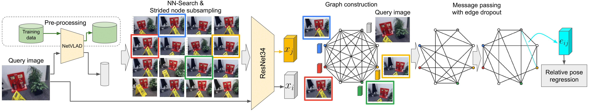

# Visual Camera Re-Localization using Graph Neural Networks and Relative Pose Supervision


[Mehmet Özgür Türkoǧlu](https://scholar.google.com/citations?user=rJpIyQUAAAAJ),
[Eric Brachmann](https://scholar.google.de/citations?user=cAIshsYAAAAJ),
[Konrad Schindler](https://igp.ethz.ch/personen/person-detail.html?persid=143986),
[Gabriel J. Brostow](http://www0.cs.ucl.ac.uk/staff/G.Brostow/),
[Áron Monszpart](http://aron.monszp.art) - **3DV 2021**.

[ \[Paper on ArXiv\] ](https://arxiv.org/abs/2104.02538)
[ \[Paper on IEEE Explore\] ](https://ieeexplore.ieee.org/abstract/document/9665967)
[ \[Presentation (long)\] ](https://github.com/nianticlabs/relpose-gnn/raw/assets/assets/RelPoseGNN_3DV21_long.pdf)
[ \[Presentation (short)\] ](https://github.com/nianticlabs/relpose-gnn/raw/assets/assets/RelPoseGNN_3DV21_short.pdf)
[ \[Poster\] ](https://github.com/nianticlabs/relpose-gnn/raw/assets/assets/RelPoseGNN_3DV21_poster.pdf)


## 🌌 Overview


<b>Relative pose regression.</b>
We combine the efficiency of image retrieval methods and the ability of graph neural networks to selectively and 
iteratively refine estimates to solve the challenging relative pose regression problem. Given a query image, we first 
find similar images to it using a differentiable image retrieval method NetVLAD. We preserve the diversity of neighbors
by strided subsampling before building a fully connected Graph Neural Network (GNN). Node representations x<sub>i</sub> are 
initialized from ResNet34, and are combined using MLP-s into edge features e<sub>ij</sub>. Finally, the relative pose
regression layer maps the refined edge representations into relative poses between image pairs. Edge dropout is only 
applied at training time.


## 📈 Results

<table>
    <thead>
      <tr>
          <td></td>
          <td align="center">Trained on 7 training sets</td>
      </tr>
    </thead>
    <tbody>
    <tr>
        <td>Chess</td>
        <td align="center">
            <a href="https://storage.googleapis.com/niantic-lon-static/research/relpose-gnn/videos/chess_7scenes.mp4">
                <!---->
                
            </a><br />
            pred. poses:<a href="https://storage.googleapis.com/niantic-lon-static/research/relpose-gnn/predictions/relpose_gnn__multi_39_chess_0.09_2.9.npz">
              relpose_gnn__multi_39_chess_0.09_2.9.npz
            </a>
        </td>
    </tr>
    <tr>
        <td>Fire</td>
        <td align="center">
            <a href="https://storage.googleapis.com/niantic-lon-static/research/relpose-gnn/videos/fire_7scenes.mp4">
                <!---->
                
            </a><br />
            pred. poses:<a href="https://storage.googleapis.com/niantic-lon-static/research/relpose-gnn/predictions/relpose_gnn__multi_39_fire_0.23_7.4.npz">
              relpose_gnn__multi_39_fire_0.23_7.4.npz
            </a>
        </td>
    </tr>
    <tr>
        <td>Heads</td>
        <td align="center">
            <a href="https://storage.googleapis.com/niantic-lon-static/research/relpose-gnn/videos/heads_7scenes.mp4">
                <!---->
                                
            </a><br />
            pred. poses:<a href="https://storage.googleapis.com/niantic-lon-static/research/relpose-gnn/predictions/relpose_gnn__multi_39_heads_0.13_8.5.npz">
              relpose_gnn__multi_39_heads_0.13_8.5.npz
            </a>
        </td>
    </tr>
    <tr>
        <td>Office</td>
        <td align="center">
            <a href="https://storage.googleapis.com/niantic-lon-static/research/relpose-gnn/videos/office_7scenes.mp4">
                <!---->
                                
            </a><br />
            pred. poses:<a href="https://storage.googleapis.com/niantic-lon-static/research/relpose-gnn/predictions/relpose_gnn__multi_39_office_0.15_4.1.npz">
              relpose_gnn__multi_39_office_0.15_4.1.npz
            </a>
        </td>
    </tr>
    <tr>
        <td>Pumpkin</td>
        <td align="center">
            <a href="https://storage.googleapis.com/niantic-lon-static/research/relpose-gnn/videos/pumpkin_7scenes.mp4">
                <!---->
                
            </a><br />
            pred. poses:<a href="https://storage.googleapis.com/niantic-lon-static/research/relpose-gnn/predictions/relpose_gnn__multi_39_pumpkin_0.17_3.3.npz">
              relpose_gnn__multi_39_pumpkin_0.17_3.3.npz
            </a>
        </td>
    </tr>
    <tr>
        <td>Kitchen</td>
        <td align="center">
            <a href="https://storage.googleapis.com/niantic-lon-static/research/relpose-gnn/videos/redkitchen_7scenes.mp4">
                <!---->
                
            </a><br />
            pred. poses:<a href="https://storage.googleapis.com/niantic-lon-static/research/relpose-gnn/predictions/relpose_gnn__multi_39_redkitchen_0.20_3.6.npz">
              relpose_gnn__multi_39_redkitchen_0.20_3.6.npz
            </a>
        </td>
    </tr>
    <tr>
        <td>Stairs</td>
        <td align="center">
            <a href="https://storage.googleapis.com/niantic-lon-static/research/relpose-gnn/videos/stairs_7scenes.mp4">
                <!---->
                
            </a><br />
            pred. poses:<a href="https://storage.googleapis.com/niantic-lon-static/research/relpose-gnn/predictions/relpose_gnn__multi_39_stairs_0.23_6.4.npz">
              relpose_gnn__multi_39_stairs_0.23_6.4.npz
            </a>
        </td>
    </tr>
    </tbody>
</table>


## ✏️ 📄 Citation

If you find our work useful or interesting, please cite our paper:

```latex
@inproceedings{turkoglu2021visual,
  title={{Visual Camera Re-Localization Using Graph Neural Networks and Relative Pose Supervision}},
  author={T{\"{u}}rko\u{g}lu, Mehmet {\"{O}}zg{\"{u}}r and 
          Brachmann, Eric and 
          Schindler, Konrad and 
          Brostow, Gabriel and 
          Monszpart, \'{A}ron},
  booktitle={International Conference on 3D Vision ({3DV})},
  year={2021},
  organization={IEEE}
}
```

## Reproducing results: 7-Scenes

### Source code

```shell
export RELPOSEGNN="${HOME}/relpose_gnn" 
git clone --recurse-submodules --depth 1 https://github.com/nianticlabs/relpose-gnn.git ${RELPOSEGNN}
```

### Setup

We use a Conda environment that makes it easy to install all dependencies. Our code has been tested on Ubuntu 20.04 with PyTorch 1.8.2 and CUDA 11.1.

1. Install [miniconda](https://docs.conda.io/en/latest/miniconda.html) with Python 3.8.
2. Create the conda environment:
   ```shell
   conda env create -f environment-cu111.yml
   ```
3. Activate and verify the environment: 
   ```shell
   conda activate relpose_gnn
   python -c 'import torch; \
              print(f"torch.version: {torch.__version__}"); \
              print(f"torch.cuda.is_available(): {torch.cuda.is_available()}"); \
              import torch_scatter; \
              print(f"torch_scatter: {torch_scatter.__version__}")'
   ```


### Set more paths

```shell
export SEVENSCENES="/mnt/disks/data-7scenes/7scenes"
export DATADIR="/mnt/disks/data"
export SEVENSCENESRW="${DATADIR}/7scenes-rw"
export PYTHONPATH="${RELPOSEGNN}:${RELPOSEGNN}/python:${PYTHONPATH}"
```

### I. Prepare the 7-Scenes dataset

1. Download

    ```shell
    mkdir -p "${SEVENSCENES}" || (mkdir -p "${SEVENSCENES}" && chmod go+w -R "${SEVENSCENES}")
    for SCENE in "chess" "fire" "heads" "office" "pumpkin" "redkitchen" "stairs"; do
      test -f "${SEVENSCENES}/${SCENE}.zip" || \
        (wget -c "http://download.microsoft.com/download/2/8/5/28564B23-0828-408F-8631-23B1EFF1DAC8/${SCENE}.zip" -O "$SEVENSCENES/$SCENE.zip" &)
    done
    ```

2. Extract

    ```shell
    find "${SEVENSCENES}" -maxdepth 1 -name "*.zip" | xargs -P 7 -I fileName sh -c 'unzip -o -d "$(dirname "fileName")" "fileName"'
    find "${SEVENSCENES}" -mindepth 2 -name "*.zip" | xargs -P 7 -I fileName sh -c 'unzip -o -d "$(dirname "fileName")" "fileName"'
    ```

### II. Image retrieval

For graph construction we incorporate the NetVLAD image retrieval CNN model.
It is based on this repository: https://github.com/sfu-gruvi-3dv/sanet_relocal_demo.
You'll need preprocessed `.bin` files (`train_frames.bin`, `test_frames.bin`) for each scene.

#### Pre-processed

   Coming soon...

#### Generate yourself

   ```shell
   for SCENE in "chess" "fire" "heads" "office" "pumpkin" "redkitchen" "stairs"; do
     python python/external/sanet_relocal_demo/seq_data/seven_scenes/scenes2seq.py \
       "${SEVENSCENES}/${SCENE}" \
       --dst-dir "${SEVENSCENESRW}/${SCENE}"
   done
   ```

### III. Graph generation

Before starting to train the model, train and test graphs should be generated to speed up
the dataloaders, and not have to run NN search during training.

#### III.A. Pre-processed

1. Download
 
    - Test
       ```shell
       mkdir -p "${SEVENSCENESRW}" || (mkdir -p "${SEVENSCENESRW}" && chmod go+w -R "${SEVENSCENESRW}")
       for SCENE in "chess" "fire" "heads" "office" "pumpkin" "redkitchen" "stairs"; do
         wget -c "https://storage.googleapis.com/niantic-lon-static/research/relpose-gnn/data/${SCENE}_fc8_sp5_test.tar" \
              -O "${SEVENSCENESRW}/${SCENE}_fc8_sp5_test.tar"
       done
       ```
      
   - Train
      ```shell
      for SCENE in "chess" "fire" "heads" "office" "pumpkin" "redkitchen" "stairs"; do
        wget -c "https://storage.googleapis.com/niantic-lon-static/research/relpose-gnn/data/${SCENE}_fc8_sp5_train.tar" \
             -O "${SEVENSCENESRW}/${SCENE}_fc8_sp5_train.tar"
      done
      ```

2. Extract

    ```shell
    (cd "${SEVENSCENESRW}"; \
     find "${SEVENSCENESRW}" -mindepth 1 -maxdepth 1 -name "*.tar" | xargs -P 7 -I fileName sh -c 'tar -I pigz -xvf "fileName"')
    ````

#### III.B. Generate yourself 

- For testing a model

   ```shell
   for SCENE in "chess" "fire" "heads" "office" "pumpkin" "redkitchen" "stairs"; do
      python python/niantic/datasets/dataset_7Scenes_multi.py \
        "${SCENE}" \
        "test" \
        --data-path "${SEVENSCENES}" \
        --graph-data-path "${SEVENSCENESRW}" \
        --seq-len 8 \
        --sampling-period 5 \
        --gpu 0
   done
   ```

- For training a multi-scene model (Table 1. in paper)

   ```shell
   python python/niantic/datasets/dataset_7Scenes_multi.py \
     multi \
     "train" \
     --data-path "${SEVENSCENES}" \
     --graph-data-path "${SEVENSCENESRW}" \
     --seq-len 8 \
     --sampling-period 5 \
     --gpu 0
   ```

- For training a single-scene model (Table 1. in supplementary)

   ```shell
   for SCENE in "chess" "fire" "heads" "office" "pumpkin" "redkitchen" "stairs"; do
      python python/niantic/datasets/dataset_7Scenes_multi.py \
        "${SCENE}" \
        train \
        --data-path "${SEVENSCENES}" \
        --graph-data-path "${SEVENSCENESRW}" \
        --seq-len 8 \
        --sampling-period 5 \
        --gpu 0
   done
   ```
   
### Evaluation

#### Pre-trained

1. Download pre-trained model trained with entire 7-Scenes training scenes (Table 1 in the paper)
   ```shell
   wget \
    -c "https://storage.googleapis.com/niantic-lon-static/research/relpose-gnn/models/relpose_gnn__multi_39.pth.tar" \
    -O "${DATADIR}/relpose_gnn__multi_39.pth.tar"
   ```
2. Evaluate on each 7scenes test scene 
   ```shell
   for SCENE in "chess" "fire" "heads" "office" "pumpkin" "redkitchen" "stairs"; do
      python -u ${RELPOSEGNN}/python/niantic/testing/test.py \
        --dataset-dir "${SEVENSCENES}" \
        --test-data-dir "${SEVENSCENESRW}" \
        --weights "${DATADIR}/relpose_gnn__multi_39.pth.tar" \
        --save-dir "${DATADIR}" \
        --gpu 0 \
        --test-scene "${SCENE}"
   done
   ```

3. Download pre-trained models trained with 7-Scenes' 6 training scenes (Table 2 in the paper)
   
   ```shell
   wget \
    -c "https://storage.googleapis.com/niantic-lon-static/research/relpose-gnn/models/6Scenes_${SCENE}_epoch_039.pth.tar" \
    -O "${DATADIR}/6Scenes_${SCENE}_epoch_039.pth.tar"
   ```

4. Evaluate each model on a corresponding remaining scene
   ```shell
   for SCENE in "chess" "fire" "heads" "office" "pumpkin" "redkitchen" "stairs"; do
      python -u ${RELPOSEGNN}/python/niantic/testing/test.py \
        --dataset-dir "${SEVENSCENES}" \
        --test-data-dir "${SEVENSCENESRW}" \
        --weights "${DATADIR}/6Scenes_${SCENE}_epoch_039.pth.tar" \
        --save-dir "${DATADIR}" \
        --gpu 0 \
        --test-scene "${SCENE}"
   done
   ```
5. Download pre-trained models trained with 7-Scenes' single training scene (Table 1. in the supp.)
   
   ```shell
   wget \
    -c "https://storage.googleapis.com/niantic-lon-static/research/relpose-gnn/models/1Scenes_${SCENE}_epoch_039.pth.tar" \
    -O "${DATADIR}/1Scenes_${SCENE}_epoch_039.pth.tar"
   ```

6. Evaluate each model on the same scene
   ```shell
   for SCENE in "chess" "fire" "heads" "office" "pumpkin" "redkitchen" "stairs"; do
      python -u ${RELPOSEGNN}/python/niantic/testing/test.py \
        --dataset-dir "${SEVENSCENES}" \
        --test-data-dir "${SEVENSCENESRW}" \
        --weights "${DATADIR}/1Scenes_${SCENE}_epoch_039.pth.tar" \
        --save-dir "${DATADIR}" \
        --gpu 0 \
        --test-scene "${SCENE}"
   done
   ```

### Train yourself
1. 7 scenes training (Table 1. in the paper)
    ```shell
    python -u ${RELPOSEGNN}/python/niantic/training/train.py \
      --dataset-dir "${SEVENSCENES}" \
      --train-data-dir "${SEVENSCENESRW}" \
      --test-data-dir "${SEVENSCENESRW}" \
      --save-dir "${DATADIR}" \
      --gpu 0 \
      --experiment 0 \
      --test-scene multi
    ````

2. 6 scenes training (Table 2. in the paper)
   ```shell
   for SCENE in "chess" "fire" "heads" "office" "pumpkin" "redkitchen" "stairs"; do
      python -u ${RELPOSEGNN}/python/niantic/training/train.py \
        --dataset-dir "${SEVENSCENES}" \
        --train-data-dir "${SEVENSCENESRW}" \
        --test-data-dir "${SEVENSCENESRW}" \
        --save-dir "${DATADIR}" \
        --gpu 0 \
        --experiment 1 \
        --test-scene "${SCENE}"
   done

3. Single scene training (Table 1. in the supp.)
   ```shell
   for SCENE in "chess" "fire" "heads" "office" "pumpkin" "redkitchen" "stairs"; do
      python -u ${RELPOSEGNN}/python/niantic/training/train.py \
        --dataset-dir "${SEVENSCENES}" \
        --train-data-dir "${SEVENSCENESRW}" \
        --test-data-dir "${SEVENSCENESRW}" \
        --save-dir "${DATADIR}" \
        --gpu 0 \
        --experiment 2 \
        --train-scene "${SCENE}" \
        --test-scene "${SCENE}" \
        --max-epoch 100
   done


## Reproducing results: Cambridge Landmarks


### Graph generation

Before starting to train the model, train and test graphs should be generated to speed up
the dataloaders, and not have to run NN search during training.

#### A. Pre-processed

1. Download
 
    - Test
       ```shell
       mkdir -p "${CAMBRIDGERW}" || (mkdir -p "${CAMBRIDGERW}" && chmod go+w -R "${CAMBRIDGERW}")
       for SCENE in "KingsCollege", "OldHospital", "StMarysChurch", "ShopFacade", "GreatCourt"; do
         wget -c "https://storage.googleapis.com/niantic-lon-static/research/relpose-gnn/data/${SCENE}_fc8_sp3_test.tar.gz" \
              -O "${CAMBRIDGERW}/${SCENE}_fc8_sp3_test.tar.gz"
       done
       ```
   - Train
      ```shell
      for SCENE in "KingsCollege", "OldHospital", "StMarysChurch", "ShopFacade", "GreatCourt"; do
        wget -c "https://storage.googleapis.com/niantic-lon-static/research/relpose-gnn/data/${SCENE}_fc8_sp3_train.tar.gz" \
             -O "${CAMBRIDGERW}/${SCENE}_fc8_sp3_train.tar.gz"
      done
      ```

2. Extract

    ```shell
    (cd "${CAMBRIDGERW}"; \
     find "${CAMBRIDGERW}" -mindepth 1 -maxdepth 1 -name "*.tar.gz" | xargs -P 7 -I fileName sh -c 'tar -I pigz -xvf "fileName"')
    ````
    

### Evaluation

#### Pre-trained

1. Download pre-trained model trained with entire Cambridge training scenes (Table 3 in the paper)
   ```shell
   wget \
    -c "https://storage.googleapis.com/niantic-lon-static/research/relpose-gnn/models/relpose_gnn_cambridge_epoch_149.pth.tar" \
    -O "${DATADIR}/relpose_gnn_cambridge_epoch_149.pth.tar"
   ```
2. Evaluate on each Cambridge test scene 
   ```shell
   for SCENE in "KingsCollege", "OldHospital", "StMarysChurch", "ShopFacade", "GreatCourt"; do
      python -u ${RELPOSEGNN}/python/niantic/testing/test.py \
        --dataset-dir "${CAMBRIDGE}" \
        --test-data-dir "${CAMBRIDGERW}" \
        --weights "${DATADIR}/relpose_gnn_cambridge_epoch_149.pth.tar" \
        --save-dir "${DATADIR}" \
        --gpu 0 \
        --test-scene "${SCENE}"
   done
   ```


### Train yourself
1. Cambridge training (Table 3 in the paper)
    ```shell
    python -u ${RELPOSEGNN}/python/niantic/training/train.py \
      --dataset-dir "${CAMBRIDGE}" \
      --train-data-dir "${CAMBRIDGERW}" \
      --test-data-dir "${CAMBRIDGERW}" \
      --save-dir "${DATADIR}" \
      --gpu 0 \
      --experiment 0 \
      --test-scene multi
    ````
    
    
    
 

   
   
## 🤝 Acknowledgements

We would like to thank Galen Han for his extensive help with this project.  
We also thank Qunjie Zhou, Luwei Yang, Dominik Winkelbauer, Torsten Sattler, and Soham Saha
for their help and advice with baselines.

## 👩‍⚖️ License

Copyright © Niantic, Inc. 2021. Patent Pending. All rights reserved. Please see the [license](LICENSE) file for terms.
